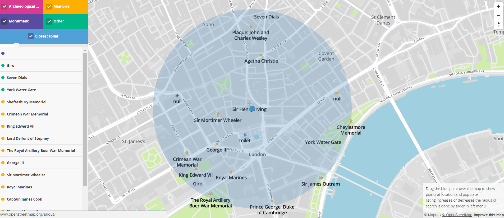

# Monuments map of Greater London

Purpose of this application is to show historical monuments,remains of London on map. Most important features are:
- search by proximity to my current location
- search by historical places categories(Archeological site, monuments, memorials and rest )
- search for closest restroom
- showing list of found points
- ability to increase or decrease radius of searching 

This is it in action:



The application consist two main parts, which are frontend web application and backand python application. Python script is also communicating with PostfreSQL database.
The whole project is located in /htdocs/pdt/ directory

## Frontend

The frontend application is a static HTML page (`index.html`), which shows a mapbox-gl.js widget and . It is using bootstrap for layout styling. Frontend is working with browserify, because of node.js modules usage. The whole project is wrapped into bundle.js .
All relevant frontend code is in `/htdocs/pdt/js/pdt/controller.js` which is referenced from `index.html`. The frontend code is very simple, its only responsibilities are:
- show the map
- call the backend services
- show points on map
- change radius circle
- show list of found points
- show and hide mapbox layers
- handle filter controlls

## Backend

The backend application is written in Python and is responsible for querying geo data, and send return it back to javascript controller. Python script is using psycopg2 module, which has functions to communicate with Postgresql database.

### Data

Data source is originated from OpenStreetMap. I downloaded an .osm file(http://download.geofabrik.de/europe/great-britain/england/greater-london.html) covering the area of greater london (around 43MB) and imported it using the `osm2pgsql` tool into the standard OSM schema in WGS 84 with hstore enabled. To speedup the queries I created an index on geometry column (`way`) in all tables. GeoJSON is generated by using a stndard `st_asgeojson` function, and the whole response is wrapped into object created by json_build_object function.

### Api

**Find memorial in proximity to coordinates and in given radius**

http://pdt.localhost:8082/cgi-bin/memorial.py?longitude=-0.12416126168082542&latitude=51.511618719063506&radius=300

All calls for historical point type have same parameters. It's just differ in script name.

#### Response

Python scripts return geojson response. This response has contains an array of found points. Every points consists from geometry data and properties data. Geometry data contains type of this database record and coordinate of this record on the map:
```
[{
geometry:{type: "Point", coordinates: [-0.1329808, 51.5133345]}
properties:{title: "Blue Plaque: Thomas Hearne"}
},
.
.
.
]
```
`geojson` contains a geojson with locations of found points and it's also contains information about given point.

## Author

Marián Čarnoký
